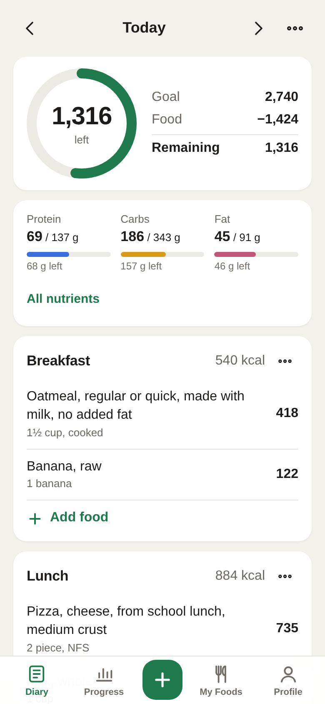
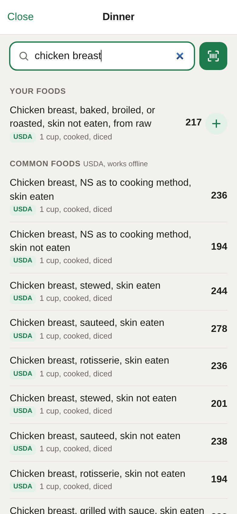
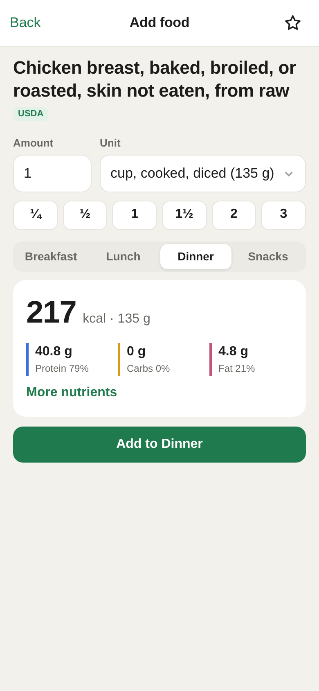
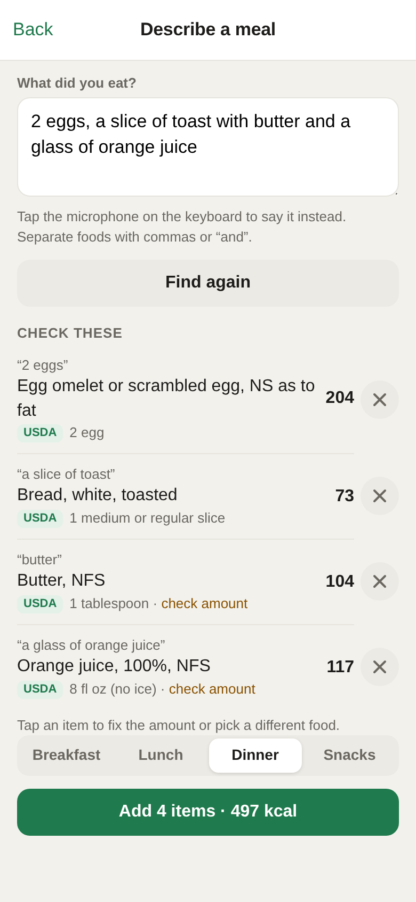
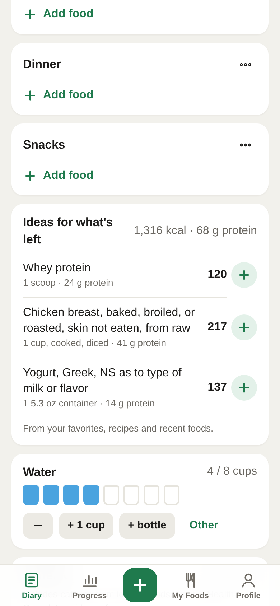
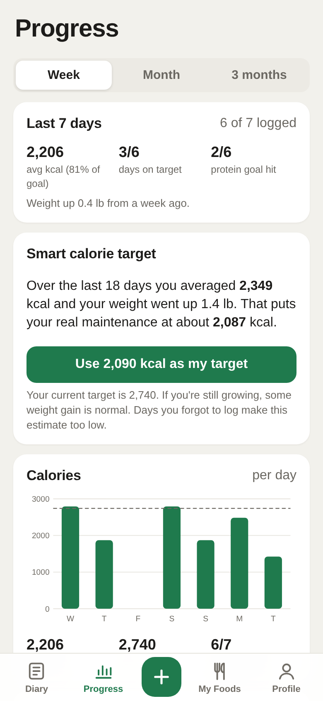
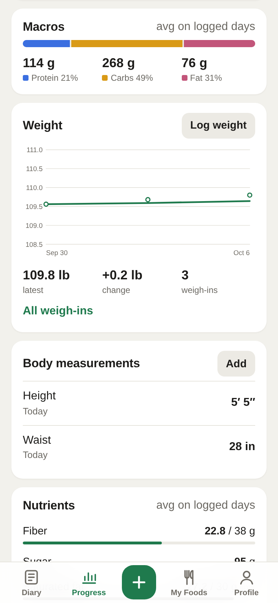
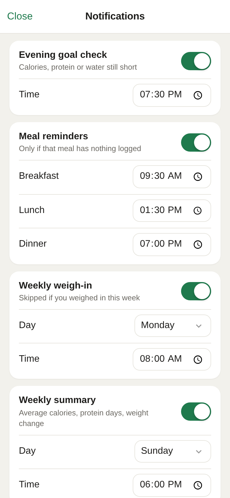

# Plateful

A private calorie and nutrition tracker for iPhone and Android, built as an installable
web app (no app store needed). Food data stays on the phone in IndexedDB.

**Install:** open the link below on your phone.
- iPhone: in Safari, tap Share › Add to Home Screen.
- Android: in Chrome, tap Install app when offered (or ⋮ › Install app), or use the
  Install button under Profile.

Live: https://plateful.leokthakur.workers.dev

  
  
  
  

  
  
  
  

Screenshots use made-up demo data.

## Features
- Food diary by meal with calories left, macros, vitamins and minerals; set your own goal (at least, at most, or none) for any nutrient
- About 5,400 USDA foods built in (works offline), brands and barcodes via Open Food Facts
- Barcode scanner, custom foods, recipes, saved meals, favorites, one-tap re-logging, copy meal or day
- Describe a meal in words ("2 eggs and toast"), parsed on the phone
- Calorie target from age, sex, height, weight and activity (growth-aware for kids and teens), plus a smart target from your real weight trend
- Weight, body measurements, water, caffeine and exercise tracking with charts
- Push reminders for unlogged meals and unmet goals, weekly summary, app-icon badge
- CSV export, full backup and restore, delete everything

## Layout
- `public/`: the app (static files served as-is)
- `worker/`: Cloudflare Worker that serves `public/` and runs push reminders
- `tools/`: data build scripts
- `docs/screenshots/`: README images

## Run locally
    npx wrangler d1 execute plateful --local --file worker/schema.sql   # once
    npx wrangler dev --port 8787 --test-scheduled

Local push signing needs `.dev.vars` (git-ignored) containing
`VAPID_PRIVATE_JWK='{...}'`. Trigger the reminder cron with `curl "localhost:8787/__scheduled?cron=*/15+*+*+*+*"`.

## Deploy
    npx wrangler deploy

Bump `VERSION` in `public/sw.js` whenever app files change so installed copies update.

First-time setup on a new Cloudflare account:
    npx wrangler d1 create plateful            # put the id in wrangler.jsonc
    npx wrangler d1 execute plateful --remote --file worker/schema.sql
    npx wrangler secret put VAPID_PRIVATE_JWK  # private key JWK; public key goes in wrangler.jsonc vars

Everything fits in Cloudflare's free plan (Workers, D1, one cron trigger).

## Push reminders
The Worker checks every 15 minutes which reminders are due in each phone's time zone:
meal reminders (only if that meal has nothing logged), an evening goal check (only if
calories, protein or water are still short), a weekly weigh-in, and a weekly summary.

The server never receives food entries. The app sends only which meals have entries
today, whether goals are met, and the last weigh-in date. The push carries just the
reminder type; the service worker writes the text from a summary saved on the phone.
iPhone only delivers web push to apps added to the Home Screen (iOS 16.4+); Android Chrome
delivers it to installed apps and browser tabs alike.

## Data sources
- `public/data/fndds.json`: about 5,400 generic and restaurant foods from USDA FNDDS 2021–2023,
  bundled for offline search. Rebuild with `tools/build_fndds.py` (see the header for the source URL).
- Open Food Facts: branded search and barcodes (online, crowd-sourced).
- USDA Branded Foods: optional, needs a free key from api.data.gov (Profile → USDA API key).

## License
Plateful's code is released under the [MIT License](LICENSE). Bundled third-party code and
data keep their own licenses; see [THIRD_PARTY_NOTICES.md](THIRD_PARTY_NOTICES.md).
